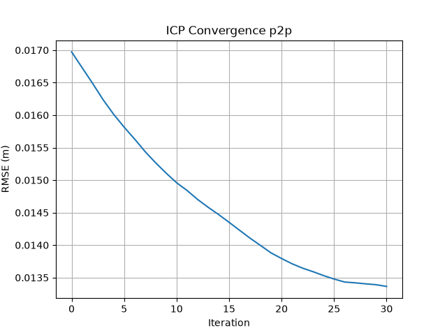
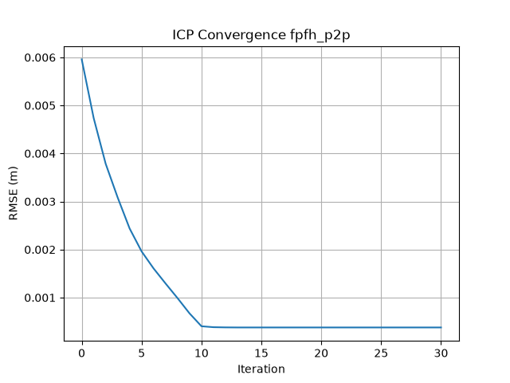
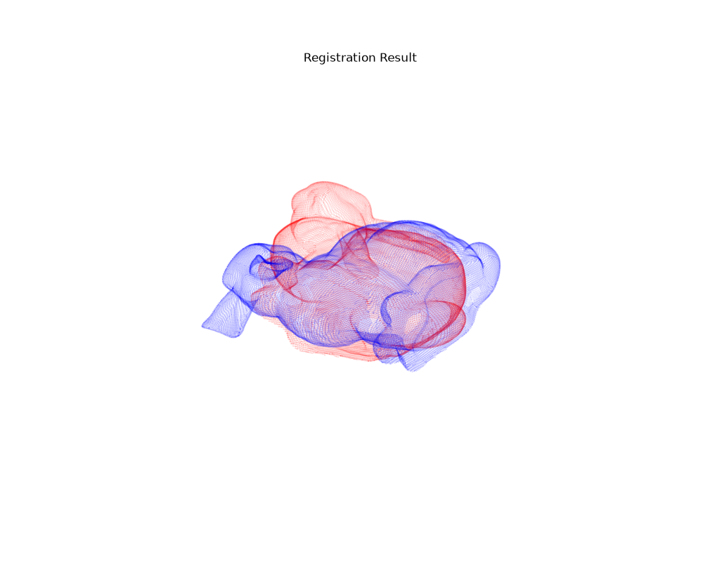
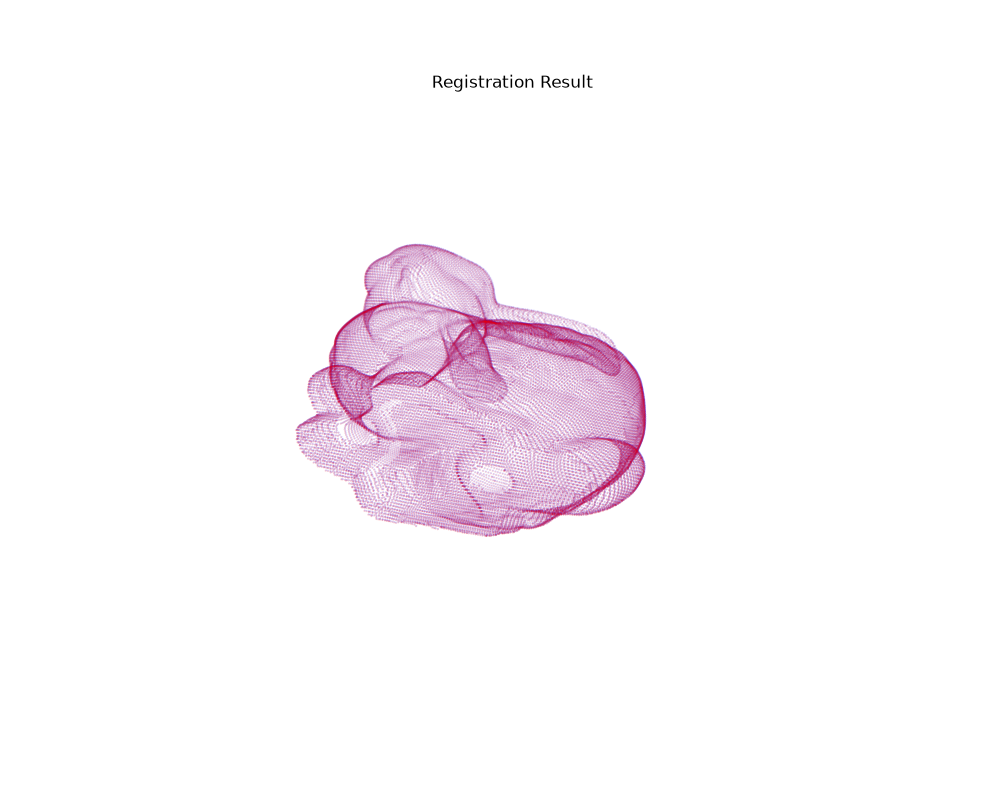

# Point Cloud Registration

## 概要
異なる座標系を持つ2つの3D点群データ（ウサギのモデル）を、同一の座標系に位置合わせ（レジストレーション）するプログラムです。
既存の3D処理ライブラリ（Open3D等）を使用せず、`numpy` による行列演算のみで主要なレジストレーションアルゴリズムを実装しています。

## 開発の背景・目的
3D点群処理アルゴリズムのブラックボックス化を避け、根底にある数学的アプローチを深く理解することを目的として開発しました。あえて外部の3D処理ライブラリを使用しないという制約を設けることで、以下のスキル習得を目指しました。
- ICPアルゴリズムの数学的理解と実装
- FPFH特徴量とRANSACを用いた大域的な初期位置合わせの実装
- `numpy` を用いた効率的な行列演算・最適化

## 使用技術
- **言語**: Python 3.12.3
- **ライブラリ**: numpy, matplotlib
- **環境構築**: Docker
- **パッケージ管理**: Poetry
- **コードフォーマッター**: Black

## 実装したアルゴリズム
本リポジトリでは、以下の複数のアプローチを実装し、精度と収束速度の比較を行っています。

1. **Point-to-Point ICP**
   - 対応する点同士のユークリッド距離の二乗和を最小化するオーソドックスな手法。
2. **Point-to-Plane ICP**
   - ターゲット点群の局所的な平面（法線ベクトル）に対する距離を最小化する手法。
3. **Global Registration (FPFH + RANSAC) + ICP**
   - 初期位置の大きなズレに対応するため、FPFH特徴量とRANSACを用いて大まかな位置合わせを行った後、ICPで微調整を行う手法。局所解に陥るのを防ぎ、最も高い精度（RMSE）を達成しました。

## 実行結果
### 収束の様子
<table>
  <tr>
    <td align="center"><b>重心合わせ</b></td>
    <td align="center"><b>FPFH & RANSAC</b></td>
  </tr>
  <tr>
    <td></td>
    <td></td>
  </tr>
</table>

FPFH & RANSACでグローバルレジストレーションを行った結果、収束速度と精度がともに良い結果を得られました。最終的に**RMSE 0.00377 m**を達成しました。

### レジストレーション後の様子
<table>
  <tr>
    <td align="center"><b>重心合わせ</b></td>
    <td align="center"><b>FPFH & RANSAC</b></td>
  </tr>
  <tr>
    <td></td>
    <td></td>
  </tr>
</table>

FPFH & RANSACを用いた場合はレジストレーションを正確に行えていることがわかります。

## セットアップと実行方法 
本プロジェクトは、UNIX系OS（Linux/macOS）またはWindows上のWSL2環境での実行を前提としています。
パッケージ管理には `poetry` を、コンテナ環境には `Docker` を使用しています。

1. Poetry を使用したローカル環境での実行
```bash
poetry install

# アルゴリズムの実行（標準出力と標準エラー出力を exec.log に記録する場合）
poetry run python src/main.py > exec.log 2>&1
```

2. コードフォーマット
```bash
poetry add --group dev black
poetry run black .
```

3. Dockerでの実行
```bash
docker build -t pointcloud-registration .
docker run --rm -v $(pwd)/data:/code/data pointcloud-registration
```